# Help Document

*假设服务器的根目录地址为`localhost:8000`*
## 登录
>  **用户种类**
> - 管理员
> - 教师
> - 学生

从`localhost:8000/SM/login`登录。
测试用的帐号如下：
- 管理员: SM/SM
- 教师: 000001/000001
- 学生: 000000001/000000001

## 教师
登录完成后进入成绩的管理界面。
可以从最上方的导航栏进入**成绩查询**、**成绩等级**、**成绩修改**界面，或**退出**管理系统

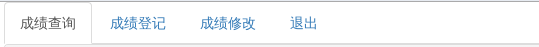

###成绩查询
在成绩查询选项卡下可以选择想要查看的课程
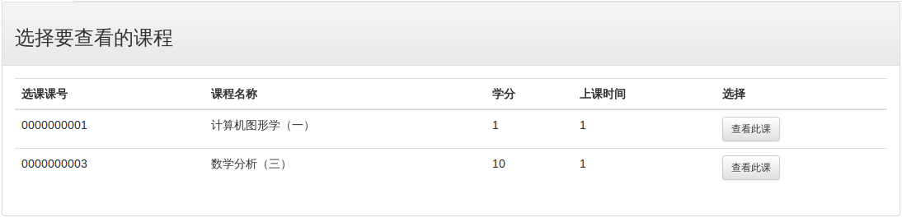

点击想要查看的课程，网页将自动载入课程统计信息和学生成绩表单
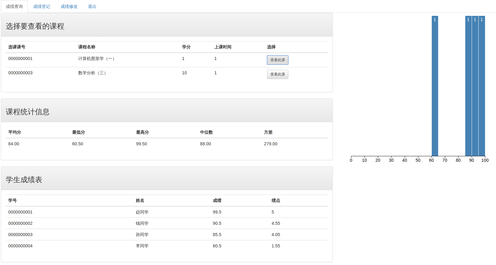

### 成绩登记
在成绩登录选项卡下可以**对尚未提交的课程更新成绩**

在左侧会自动显示尚未提交的课程

点击想要更改成绩的课程，会在右侧显示当前数据库中已有的成绩信息

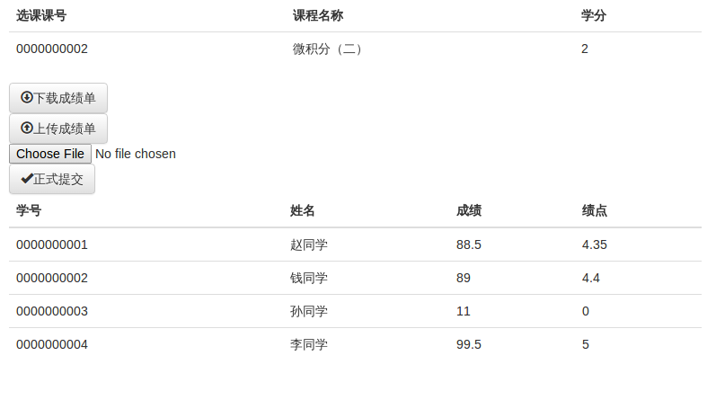

如果是**第一次提交成绩**，可以点击右侧的下载成绩单按钮下载成绩模板。

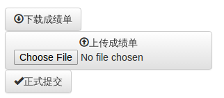

> **成绩单模板(.xlsx)**
> 成绩单模板是本系统为教师设计用来上传修改成绩的表单文件。
> 该模板会自动填入：
>  - 课程编号
>  - 课程名称
>  - 教师姓名
>  - 已有的成绩信息(教师可能在先前已经上传过成绩)
>  
>  如果修改成绩单的格式或者对应栏目的格式不对(如将姓名填入应该填成绩的单元格)，则无法录入成绩。
>  同时系统将检查xlsx中的信息与上传的目标课程信息是否匹配。

在填完了成绩后，可以点击**上传成绩单**上传成绩。可以看到成绩发生了改变
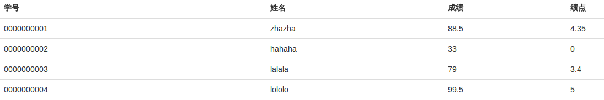

确认成绩填写完整后，如果要正式提交课程成绩，可以点击正式提交。
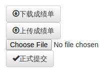
点击后提示"提交成功!"

提交后课程不再在”成绩登记“栏下出现

### 成绩修改
在成绩修改选项卡下可以对已经正式录入的成绩提出修改申请。

总体界面如下：
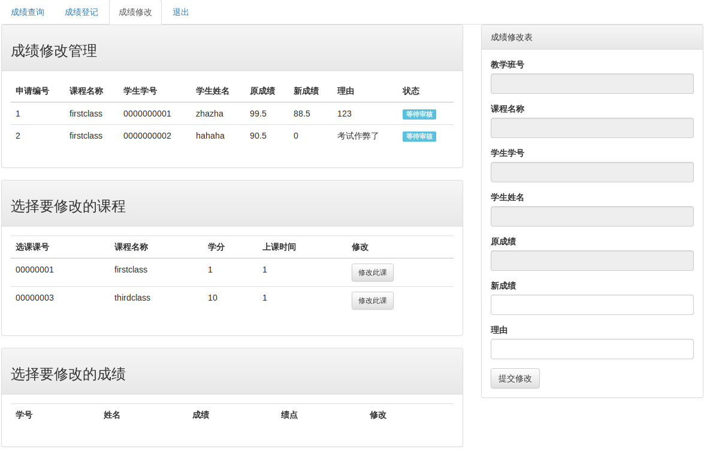

申请过的记录在**成绩修改管理**下显示

想要提出新的申请，可以
- 在**选择要修改的课程**下选择课程
- 在**选择要修改的成绩**下选择要修改的成绩。
- 在右侧**成绩修改表**填写**新成绩**和**理由**。

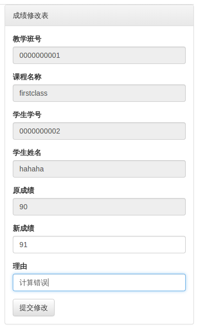

其他的老师(如此处帐号密码为`000002/000002`的教师)可以在**成绩修改**下看到你的申请，并选择是否同意
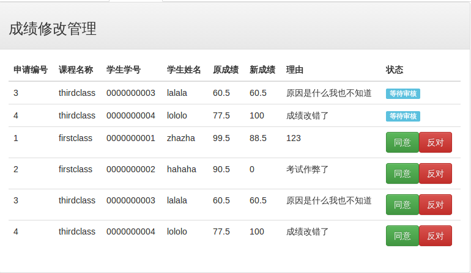

如对编号为2的申请点击同意后。
显示：

此时刷新原页面，将会看到审核状态发生了改变
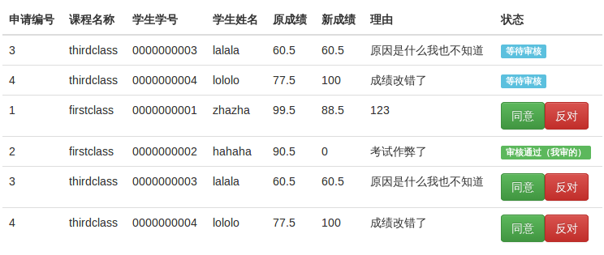

原来申请的老师(`000001/000001`)则能看到通过的审核
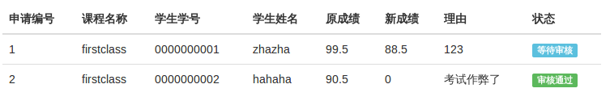

## 学生
在**成绩查询**选项卡下可以看到自己所有课程的成绩，统计信息及图标

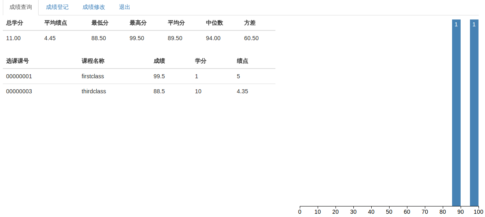
